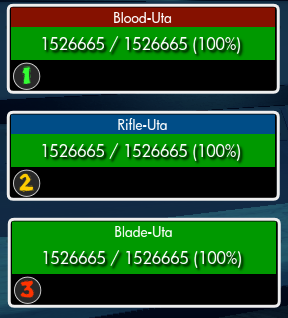

# UtaMadre
  
SWL version of Eth Uta Madre mod from TSW; see https://forums-archive.thesecretworld.com/showthread.php?86829-Addon-Uta-Madre  
  
# Configuration  
Unit frames can be moved and scaled while inside the penthouse  
`/option UtaMadre_TrackHE` [default false] ICB tracking for Hell Eternal  
`/option UtaMadre_HonorableSound` [default false] Sound alert for Honorable Combat cast  
`/option UtaMadre_BombSound` [default true] Sound alert for Time Bomb cast  
`/option UtaMadre_ImportantCastsOnly` [default true] Only display important casts  
`/option UtaMadre_MarkUta` [default false] Mark Utas with "Mark of (the) X" when targeting them (both achievement and faction versions work)  

# Install
Download and extract to `..\Secret World Legends\Data\Gui\Custom\Flash\`
